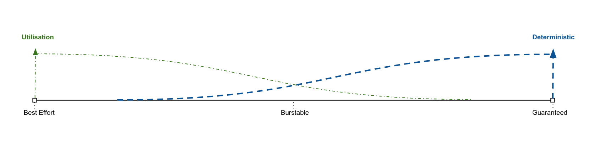

## Before you begin

Determinism can be obtained in a variety of ways inside a kubernetes cluster for Pods. 
The principle used by a majority of clusters globally is currently still a paradigm, where Pods are deployed without criterions for how much capacity the need(requests) and how much they are limited(limit) to use and fewer cluster workloads are having criterions for e.g. cpu and mem, and possibly other settings. Both of these scenarios work well for some situations and they are expressing each their extreme for how to run workloads in kubernetes. 




The Secure Cloud Platform initially used the most deterministic of the approaches, specifying e.g. cpu and mem explicitly for both requests and limits. This moved the determinism from a runtime evaluation on to a scheduling time decision. 

The next level (requiring a contractual addendum) are the ability to work with a less deterministic scheme and allow for burstable modes for cpu. Bustable means here, situations where only the request is set for cpu, where the other attributes such as e.g. memory are kept deterministic. This means that scheduling is defining the most attributes and thus workload that can be deployed can also run, with the exception of workloads that have too little cpu requests defined for the accumulated deployed Pods in a given cluster. More elaborate explanation follows underneath.

Pods that have specified a cpu request and no limit are considered burtstable as mentioned above. This means that the Pod in order to be scheduled needs to be able to get the amount of cpu it has defined in request. It may use less and if it uses less, other Pods can utilise the unused bit of cpu capacity as long as the Pod does not need it. 

Pod with interleaving workloads can thus share the cpu and if they peak at different points in time, the cpu utilisation is better than in the most deterministic situation. Allocation is normally done according to the specified limit e.g. when memory is defined as request and limit set to same value. In the case of cpu burstable, the allocation is done according to what the Pod needs and it can get whatever is available. In situations where cpu becomes a scarce resource it can only get the amount specified in the request. And there is no magic, if a number of Pods are cpu peaking at the same time each of the Pods will only get what they have specified if the accumulated requested cpu available on the node where the individual Pods is deployed. If the requested amount is higher than the available amount Pod [removal](https://kubernetes.io/docs/concepts/scheduling-eviction/pod-priority-preemption/) will start to occur. 
In other words Pods may be brought from a running state to a non-running state and your applications may stop working in a worst case situation.

The question is now, in such situations, is it possible to specify which workloads need to have priority over other workloads e.g. in a situation where e.g. a central back-end service serves all the front-end services. This could mean that the back-end service may be more important the front-end services, and thus it would be necessary to tell that to kubernetes in order for that to be able to make the right decision when pre-empting Pods. Kubernetes has an Object Type called PriorityClasses for exactly that purpose. Kubernetes itself uses these PriorityClasses internally for ensuring its own ability to run run node and system workloads, and the Secure Cloud Platform uses that same mechanism for ensuring that Technical Operations etc. is running and we can deliver the promised services.

Applications deployed on the Secure Cloud Stack may have the same need for this as seen from the example above with the front-end and back-end service, and a number of PriorityClasses has been created for that purpose:

 ```
  secure-cloud-stack-tenant-namespace-application-critical
  secure-cloud-stack-tenant-namespace-application-less-critical
  secure-cloud-stack-tenant-namespace-application-lesser-critical
  secure-cloud-stack-tenant-namespace-application-non-critical
```

## Configuring an Application to use PriorityClasses

An application enables the use of a PriorityClass by using the PriorityClassName under the Pod Specification, underneath this is exemplified for a burstable deployment based on cpu request being set and limit not set. 
As explained above this may lead to an overcommit for cpu seen from a node and cluster perspective:

``` yaml
apiVersion: apps/v1
kind: Deployment
metadata:
  name: a-customer-critical-deployment
  labels:
    app.kubernetes.io/name: back-end-deployment
spec:
  replicas: 2
  selector:
    matchLabels:
      app.kubernetes.io/name: back-end-deployment
  template:
    metadata:
      labels:
        app.kubernetes.io/name: back-end-deployment
    spec:
      terminationGracePeriodSeconds: 10 # short grace period - default is 30 seconds
      priorityClassName: "secure-cloud-stack-tenant-namespace-application-critical"
      containers:
      - image: nginxinc/nginx-unprivileged:1.20
        name: back-end-deployment
        resources:
            requests:
              memory: 990M
              cpu: 5m
            limits:
              memory: 990M
        ports:
        - containerPort: 8080
          name: http
```

If nothing is specified for the application pods, the default assigned PriorityClassName is  `secure-cloud-stack-tenant-namespace-application-non-critical`. This is something supported by kubernetes itself. 

The default grace period for a pod is 30 seconds. If you want to ensure that lower priority pods are preemted faster, you may adjust the `terminiationGracePeriod` to a feasible number of seconds lower than the default.

Please note that there may be derived classes in some situations, where e.g. an operator is used, or a sidecar is used etc. which also need to have the `priorityClassName` set in order for that not to be assigned default priority.
